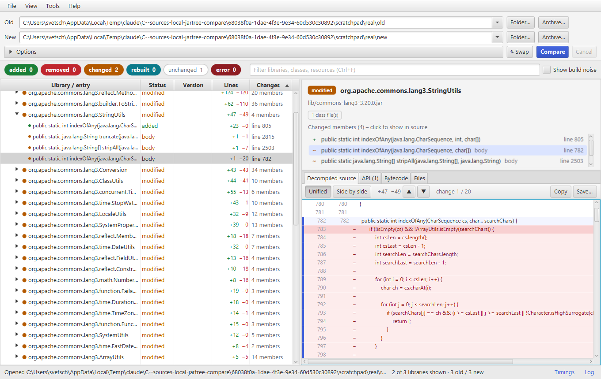
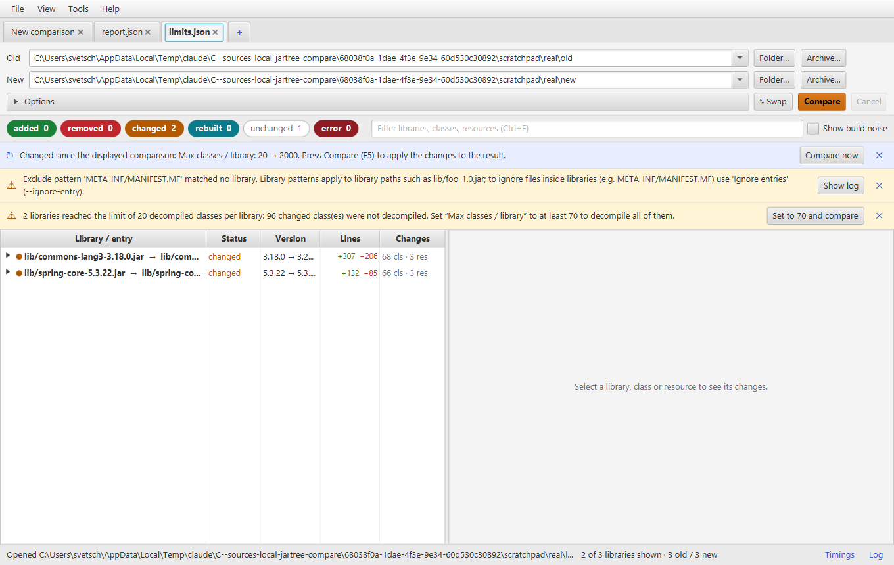
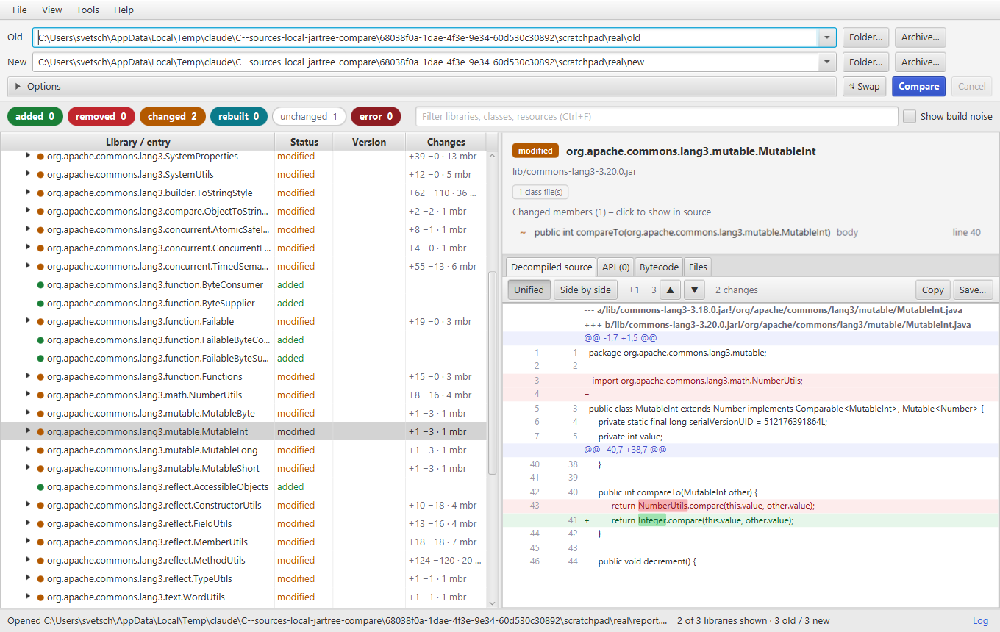
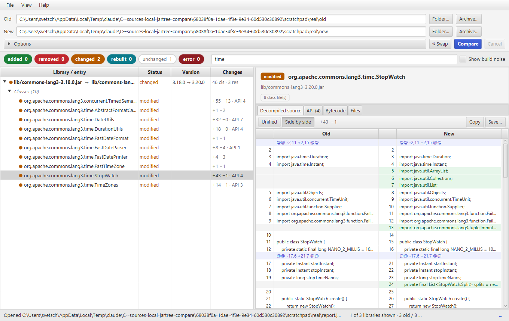
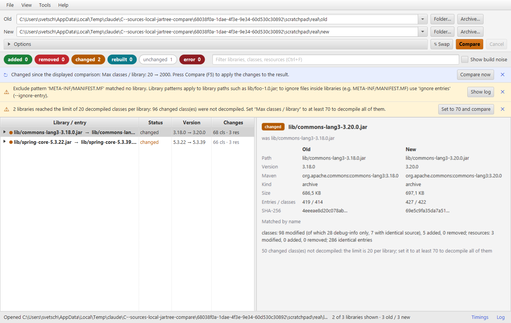

# jartree-compare

Compares two hierarchies of jar files, finds the libraries that changed, decompiles the changed classes and
shows what changed in the code — on the command line, as reports, or in a JavaFX desktop interface.

```bash
jartree-compare old-release/ new-release/ --html report.html
```



## Contents

- [What it does](#what-it-does)
- [Build](#build)
- [Command line](#command-line)
- [Desktop interface](#desktop-interface)
- [How it works](#how-it-works)
- [Cache](#cache)
- [Limits and timings](#limits-and-timings)
- [Memory](#memory)
- [Reports](#reports)
- [Native executable](#native-executable)
- [Development](#development)
- [Troubleshooting](#troubleshooting)
- [License](#license)

## What it does

Given two directory trees (or two archives) containing jars, it answers three questions:

1. **Which libraries changed?** Libraries are paired even when their file name contains a different version,
   and a library whose bytes differ only because of a rebuild is reported as such.
2. **What changed inside a changed library?** Per class: the changed methods and fields, the API delta and a
   diff of the decompiled source. Per resource: a text diff or a size comparison.
3. **How much changed, and where?** Lines added and removed per library, class and member, plus where the
   comparison spent its time.

## Build

Requires JDK 17 or newer and Maven.

```bash
mvn package
```

This produces the self-contained `target/jartree-compare.jar` (command line and GUI). Launchers:

| Script | Purpose |
|---|---|
| `jartree-compare` / `jartree-compare.cmd` | Command line |
| `jartree-compare-gui.cmd` | Desktop interface |
| `mvn javafx:run` | Desktop interface from the sources |

`java -jar target/jartree-compare.jar --version` prints the version and the git commit the jar was built from.

## Command line

```
jartree-compare [options] OLD NEW
```

`OLD` and `NEW` are directories or archives.

| Option | Description |
|---|---|
| `-o, --html FILE` | Self-contained HTML report with filters and collapsible diffs |
| `--json FILE` | JSON report including all diffs (can be reopened in the GUI) |
| `--patch FILE` | All source and text diffs as one unified diff (`a/<lib>!/<class>.java`) |
| `-v, --verbose` | Print API changes and diffs to the console |
| `-q, --quiet` | Only print the summary line |
| `--show-noise` | Also list debug-info-only / bytecode-only classes and build noise |
| `--show-unchanged` | Also list unchanged libraries |
| `-i, --include GLOB` / `-x, --exclude GLOB` | Filter **libraries** by path or file name (`**/acme-*.jar`); a pattern that matches no library is reported |
| `-e, --ignore-entry GLOB` | Ignore **entries inside** libraries (`META-INF/MANIFEST.MF`, `META-INF/maven/**`, `*.SF`; without `/` the file name matches in any directory) |
| `-p, --package PREFIX` | Only analyze classes in these packages |
| `--no-decompile` | Skip decompilation, show bytecode diffs (faster) |
| `--decompile-added` | Also decompile added and removed classes |
| `--bytecode` | Always add bytecode diffs next to source diffs |
| `--max-classes N` | Decompile at most N classes per library (default 2000) |
| `--nested-depth N` | How deep to open nested archives (default 8) |
| `-U, --context N` | Diff context lines (default 3) |
| `--fail-on-change` | Exit code 1 when libraries were added, removed or changed (for CI) |
| `--no-cache` / `--cache-dir DIR` / `--clear-cache` | Control the cache (default `~/.jartree-compare/cache`) |
| `-t, --threads N` | Worker threads |
| `--gui [OLD NEW \| FILE.jtcompare \| REPORT.json]` | Open the desktop interface |

Exit codes: `0` no differences (or `--fail-on-change` not set), `1` differences found with `--fail-on-change`,
`2` error.

Examples:

```bash
# two exploded distributions, only our own code, with a patch for code review
jartree-compare dist-1.4/ dist-1.5/ -i '**/acme-*.jar' -p com.acme --patch review.diff

# two wars, full detail on the console, ignoring manifests and Maven metadata
jartree-compare shop-2.0.war shop-2.1.war -v -e 'META-INF/MANIFEST.MF,META-INF/maven/**'

# CI gate: fail if anything but a rebuild happened
jartree-compare baseline/ build/libs/ -q --fail-on-change
```

Every run ends with a summary, the time breakdown and any limit that was reached:

```
Summary: 2 changed, 1 unchanged  (13393 ms)
Time: scan 214 ms | uncompress 90 ms | compare 907 ms | decompile 12.4 s | decompile wait 10.2 s | diff 569 ms | elapsed 13.4 s
Limit reached: 2 libraries reached the limit of 20 decompiled classes per library; 96 changed class(es) were
not decompiled. Use --max-classes 70 (or more) to decompile all of them.
```

## Desktop interface

```bash
jartree-compare-gui.cmd                                      # or: java -jar target/jartree-compare.jar
java -jar target/jartree-compare.jar --gui OLD NEW           # compare immediately
java -jar target/jartree-compare.jar --gui release.jtcompare  # open a saved comparison
java -jar target/jartree-compare.jar --gui report.json       # open a saved report
```

**Several comparisons at once.** Each comparison lives in its own tab with its own paths, options, filters and
result; the menu and the status bar always act on the active tab. Open a tab with the **+** next to the tabs or
*File ▸ New comparison* (Ctrl+N), copy the current paths into a new tab with *File ▸ Duplicate comparison*, and
close one with Ctrl+W. Comparisons in different tabs run at the same time (decompilation itself is serialized,
so tabs queue for it). The tabs of the last session are reopened on start: a tab saved as a comparison file
from that file (with its result, if it holds one), any other tab with its paths but without results.

A tab is named after its paths: every comparison renames it after the compared paths as soon as it starts (a
cancelled or failed one gives the previous name back). Saving does not rename the tab, and a reopened comparison
file gets the name it had when it was saved; the tab's tooltip shows the file that Ctrl+S saves to. An opened
JSON report names the tab after the report until the next comparison.



**Run a comparison.** Choose the old and new tree (folder, archive, or drag and drop), adjust *Options* and
press **Compare** (F5). The comparison runs in the background with progress and can be cancelled.

**Browse the result.** The tree lists libraries, their changed classes, the changed members of each class and
the changed resources.

| Column | Shows |
|---|---|
| Library / entry | Path, class name or member declaration |
| Archive name | File name of the deepest archive the row belongs to: `nested-1.1.jar` for `app.war!/WEB-INF/lib/nested-1.1.jar` (empty for exploded directories) |
| File name | File name of the deepest file the row stands for: the library's archive, a class's `Calc.class`, the class file a member is declared in (`Calc$Helper.class`), or a resource's `app.properties` |
| Status | `changed`, `rebuilt`, `added`, `removed`, `error`; for classes `modified`, `debug info`, `same source`; for members what changed (`body`, `modifiers`, `constant`, `lambda`) |
| Version | Library version change, or a class file version change |
| Lines | `+added −removed` for the row (library totals, class diff, lines inside a member, resource diff) |
| Changes | Number of classes and resources, or members of a class |

Every column except *Library / entry* can be hidden with the menu button at the right end of the column headers
or with *View ▸ Columns*. The choice is kept across restarts, becomes the default for new tabs, and is stored in
saved comparisons.

Click a column header to sort; the first click on *Lines* or *Changes* puts the largest first. The status chips
filter by status, the search box (Ctrl+F) matches libraries, classes, members and resources, and *Show build
noise* reveals debug-info-only classes, manifest timestamps and signature files. *Expand all* (Ctrl+Shift+E) opens
every library, class and folder; *Collapse all* (Ctrl+Shift+C) folds the tree back to the libraries. Both are also
in the *View* menu and the tree's context menu.

**Inspect a change.** The right pane shows library metadata, or for a class the decompiled source diff, its API
changes, the bytecode diff and the changed class files. The part that actually changed inside an edited line is
highlighted:



Diffs can be shown side by side:



**Point at a change.** Clicking a member in the tree or in the *Changed members* list scrolls the source diff to
it and marks its lines. ▲ / ▼ (or N / P) step through the changes of a diff, F7 / Shift+F7 through the changed
classes of the whole result.

**Notices** below the filter bar report reached limits, patterns that matched nothing, and options that changed
since the displayed result:



**Save and open comparisons.** *File ▸ Save comparison* (Ctrl+S) and *Save comparison as* (Ctrl+Shift+S) store
the whole tab in a `.jtcompare` file: the paths, all options, the filters, the hidden columns and, when the
comparison has been run, its result. *File ▸ Open* (Ctrl+O, or drop the file on the window) reopens it in its own
tab as it was, without re-running; Ctrl+S then saves back to it (the tooltip of the tab shows the file).
Because the file records the options that produced the result, changing an option afterwards is flagged as
usual. A comparison saved before it was run holds only its settings, which makes it a reusable definition to open
and compare again later.

**Manage the output.** *File ▸ Open* also opens JSON reports (or drop a `.json` on the window) to browse results
without re-running. *File ▸ Export* writes HTML, JSON or a patch, optionally
only the libraries the filter shows. *View ▸ Timings* (Ctrl+T) shows where the time went. *Help ▸ About* shows
the version and the git commit of the build, and the size and folder of the cache.

Paths (with a drop-down of recent ones), options, diff mode and window layout are remembered between sessions.

## How it works

1. **Scan.** Both trees are walked. Archives (`jar, war, ear, rar, sar, aar, zip`) are libraries. Nested
   archives are opened recursively (`WEB-INF/lib/*.jar`, `BOOT-INF/lib/*.jar`, jars inside an ear or zip), and
   so are exploded `classes` directories. Either side can also be a single archive.
2. **Pair.** Libraries of the two trees are matched by, in order:
   - identical path;
   - same name ignoring versions: `lib/foo-1.2.jar` matches `lib/foo-1.3.jar`, and versioned parent
     directories such as `app-2.0.war!/WEB-INF/lib` are normalized too;
   - same Maven `groupId:artifactId` (from `META-INF/maven/**/pom.properties`);
   - identical content (moved or renamed files).
3. **Classify.** Identical SHA-256 → `UNCHANGED`. Otherwise entries are compared one by one; zip timestamps and
   entry order don't count.
   - **Classes** are grouped per top-level class, inner classes included.
     - Changed methods and fields are detected in the bytecode with ASM: a method whose body changed is listed
       even when its signature did not, and changes inside lambdas are attributed to the enclosing method.
     - If only debug info differs (line numbers, local variable names, frames), the class is marked
       `debug info only`.
     - Otherwise both versions are decompiled with [Vineflower](https://github.com/Vineflower/vineflower) and
       the sources are diffed. If the decompiled sources are identical, the class is marked `bytecode only` and
       you get a bytecode diff instead — as you do when decompilation fails.
   - **Resources:** text files get a unified diff, binaries a size comparison. Volatile manifest attributes
     (`Build-Time`, `Built-By`, `Bnd-LastModified`, …), `.properties` comment lines and signature files count
     as *build noise*.
   - A library whose bytes differ but which has only noise or debug-info/bytecode-only changes is `REBUILT`;
     anything else is `CHANGED`.
4. **Report.** Console output, plus optional HTML, JSON and unified-diff reports.

## Cache

Results are cached in `~/.jartree-compare/cache`:

- **Library results:** the complete diff of a library pair, keyed by both SHA-256 digests, both paths and the
  options that influence the result. Repeating a comparison is almost instant (17.7 s → 0.75 s in a test with
  commons-lang3 and spring-core).
- **Decompiled sources:** keyed by the class file bytes, so a library version already decompiled in an earlier
  comparison is not decompiled again.

Entries unused for 60 days are pruned. *Help ▸ About* shows its current size and opens its folder. Clear the
cache with *Tools ▸ Clear cache* or `--clear-cache`, and turn it off with the *Use cache* option or `--no-cache`.

## Limits and timings

- When the class limit (`--max-classes`) or the nested archive depth (`--nested-depth`) is reached, the console,
  the HTML report and the GUI give the exact value needed, e.g. `Use --max-classes 70 (or more)`. For archives
  that were not opened, their own nesting is inspected, so the value covers every level.
- Every run reports where its time went: scan, uncompress, compare, decompile, waiting for the decompiler,
  source diffs and cache. Phases that run in parallel are summed over the worker threads, so they can add up to
  more than the elapsed time. *Decompile wait* is time libraries spent queued for the decompiler, which runs
  one library at a time. The JSON report contains the same numbers and the slowest libraries.

## Memory

Archives are never held in memory as a whole:

- **Scanning** streams each archive entry by entry and hashes files while reading them.
- **Comparing** digests both sides while streaming, then reads only the entries that differ (plus the other
  class files of a changed class, which are decompiled together). Unchanged resources — usually the bulk of a
  war — are never decompressed into memory.
- **Decompiling** resolves types by reading classes from the archive on demand, instead of keeping all of them.
- **Parallelism** is budgeted by archive size: one unit per 64 MB, so large libraries do not run side by side.

A pair of 140 MB wars compares in a 256 MB heap; the default heap of the launchers (`-Xmx4g`) is enough for
large trees.

### Giving it more heap

| Started as | How |
|---|---|
| `java -jar jartree-compare.jar` | `java -Xmx8g -jar jartree-compare.jar` |
| `jartree-compare` / `.cmd` launcher | `JAVA_OPTS=-Xmx8g` (`set JAVA_OPTS=-Xmx8g` on Windows) |
| Packaged executable (`jartree-compare.exe`) | Edit `app/jartree-compare.cfg` next to the executable and change `java-options=-Xmx4g`; do the same in `app/jartree-compare-cli.cfg` for the console launcher. Or set `_JAVA_OPTIONS=-Xmx8g` before starting it (`JAVA_TOOL_OPTIONS` is ignored here, because the built-in value wins). Or build it with the heap you want: `packaging\package.cmd app-image 8g`, `packaging/package.sh app-image 8g`, or `mvn -Pinstaller -Djpackage.xmx=8g package`. |

*Help ▸ About* and `--version` show the heap the application actually runs with.

## Reports

| Report | Contents |
|---|---|
| HTML (`--html`) | Self-contained page: summary, status filters, search, collapsible colored diffs |
| JSON (`--json`) | Full result: libraries, classes, members, resources, diffs, limits, timings. Reopen it with `--gui report.json` or *File ▸ Open* |
| Patch (`--patch`) | All decompiled source and text diffs as one unified diff, usable with `patch` or a diff viewer |

## Native executable

`jpackage` (part of the JDK) turns the jar into an application with its own launcher, icon and bundled Java
runtime — no Java installation needed on the target machine.

```bash
mvn package                       # the shaded jar first
mvn -Pinstaller package           # -> target/dist/jartree-compare (any platform)
packaging/package.cmd             # Windows: adds a console launcher as well
packaging/package.sh              # macOS / Linux
```

| Result | Contents |
|---|---|
| `target/dist/jartree-compare/jartree-compare.exe` | Starts the desktop interface |
| `target/dist/jartree-compare/jartree-compare-cli.exe` | Same application attached to a console, for the command line (Windows script only) |
| `target/dist/jartree-compare/runtime` | The bundled Java runtime (the image is about 160 MB) |

Installers instead of a plain directory: `packaging\package.cmd msi` (needs the
[WiX toolset](https://wixtoolset.org/)), `packaging/package.sh dmg`, `deb` or `rpm`, or
`mvn -Pinstaller -Djpackage.type=msi package`. Build on the platform you target: both the shaded jar and the
image contain platform specific binaries.

The icon is generated from source, so it can be changed without a drawing tool:

```bash
java tools/IconGenerator.java     # writes src/main/resources/io/jartree/gui/icon-*.png and packaging/*.ico
```

## Development

```bash
mvn test          # unit and integration tests
mvn package       # jar with tests
mvn javafx:run    # start the GUI from the sources
```

Source layout:

| Package | Responsibility |
|---|---|
| `io.jartree.scan` | Walking trees, reading archives, library metadata |
| `io.jartree.compare` | Pairing, entry comparison, member location, cache, limits, timings |
| `io.jartree.bytecode` | ASM based class analysis (API delta, member changes, bytecode text) |
| `io.jartree.decompile` | Vineflower integration (in-memory sources, no temporary files) |
| `io.jartree.report` | Console, HTML, JSON and patch output |
| `io.jartree.gui` | JavaFX interface |
| `tools/` | Icon generator (single-file Java program) |
| `packaging/` | jpackage scripts, icons and launcher settings |

The tests build their own jars by compiling small classes in memory
(`src/test/java/io/jartree/Fixtures.java`), so they need no fixtures on disk. `GuiSnapshot` (test sources)
renders the window to a PNG for visual checks:

```bash
mvn test-compile dependency:build-classpath -Dmdep.outputFile=target/cp.txt
java -cp "target/classes;target/test-classes;$(cat target/cp.txt)" io.jartree.gui.GuiSnapshot report.json out.png "com.acme.Foo"
```

The version and commit shown by `--version` and *Help ▸ About* come from `build.properties`, filled in by the
git-commit-id Maven plugin; a build without a git checkout reports `unknown`.

## Troubleshooting

| Symptom | Cause and remedy |
|---|---|
| `Unsupported JavaFX configuration: classes were loaded from 'unnamed module'` | The single jar loads JavaFX from the class path. Harmless, and the message is filtered out. |
| The GUI does not start on another operating system | The shaded jar contains the JavaFX binaries of the platform it was built on. Build it there, or use `mvn javafx:run`. |
| `OutOfMemoryError` on very large trees | Raise the heap (`JAVA_OPTS=-Xmx8g`, or `java -Xmx8g -jar …`), or lower `--threads`. A single library that does not fit is reported as `error` and the other libraries are still compared. |
| Many classes reported as changed with identical source | A different compiler or compiler version. They are marked `bytecode only` and do not count as source changes. |
| Excluding `META-INF/MANIFEST.MF` has no effect | `--exclude` filters libraries; use `--ignore-entry` for files inside libraries. |
| Stack traces wanted for errors | Set `JARTREE_DEBUG=1`. |

Decompiled output is not the original source: minor differences can come from the decompiler itself. Changes
are reported as source differences only when the decompiled text actually differs.

## License

[MIT](LICENSE) © 2026 Samuel Vetsch.

The tool uses [Vineflower](https://github.com/Vineflower/vineflower) (Apache-2.0),
[ASM](https://asm.ow2.io/) (BSD-3-Clause), [java-diff-utils](https://github.com/java-diff-utils/java-diff-utils)
(Apache-2.0), [picocli](https://picocli.info/) (Apache-2.0) and [JavaFX](https://openjfx.io/) (GPLv2 with
Classpath Exception); the shaded jar bundles them.
